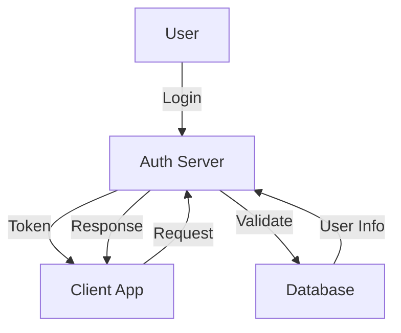

```mermaid
flowchart TD
    A[User] -->|Login| B[Auth Server]
    B -->|Token| C[Client App]
    C -->|Request| B
    B -->|Validate| D[Database]
    D -->|User Info| B
    B -->|Response| C
```

# Auth Flow Diagram

This diagram illustrates the authentication flow using a mermaid diagram.